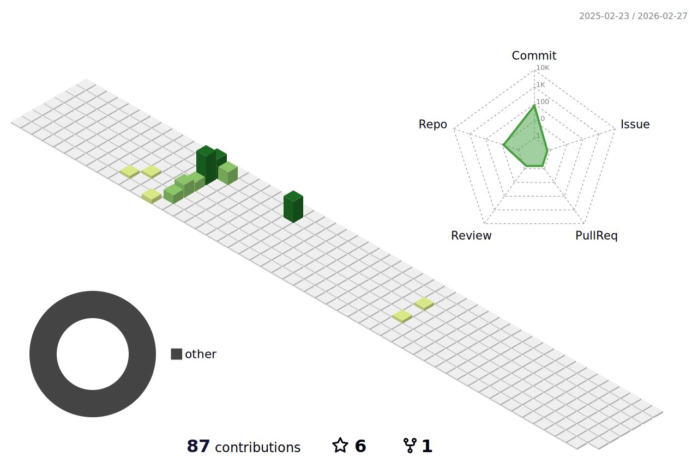

Hello, I'm <a href="https://www.linkedin.com/in/weinan-zhang/" target="_blank" rel="noopener noreferrer">Weinan</a> 

 
 

- 👯 I am Currently working as a softwatre Delivery Consultant. I have experienced the projects in Cloud Computing, Cloud Solution Architect, and Data Analytics. 

- 🤝 Database, my intersts are in the area of SQL, Oracel 12c, DB2. 

- 💬 Big data, I am keen on Machine learning and Data mining, and Data Analytics on cloud platform. 

- ☁️ Cloud Solution Architect: Docker(DCA Certified), Kubernetes(CKA Certified), AWS and Azure.
-  Progamming: Python, Java, and C++ are my favorite. 

---

<h2 align="center"><b>Knowledge Base</b></h2>
- Know/Using

|   |   |   |   |   |   |
|---|---|---|---|---|---|

- Learning

|   |  |  |
|---|---|---|

### Tools 🛠️

- Know/Using

|  |  |  |  |   |   | | Windows Terminal | WSL | many more...
|---|---|---|---|---|---|---|---|---|---|

- Learning

|  | |  | | | many more...
|---|---|---|---|---|---|
----

<h3 align="center">Connect with me</h3>

  

   

     
    
    
  

  

  

   

  

----

<h2 align="center" style="margin: 5px 10px;">Github status:</h2> 

#### Contribution Graph

<!---
--->

----

